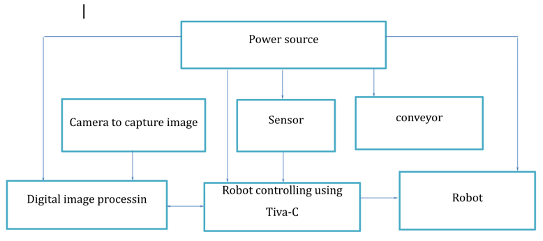
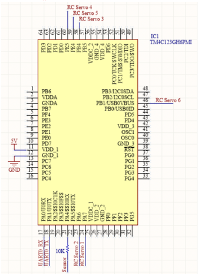
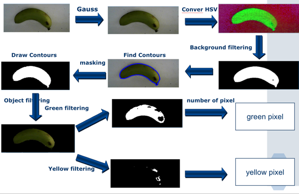
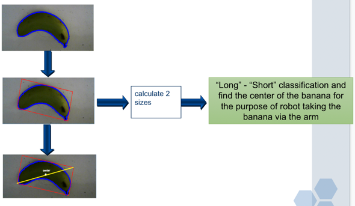

# Classifying fruit using digital image processing and 6 DOF Arm Robot

## 1. Purpose
This project implements 2 parts:
+ The implementation of processing captured image of banana, and classify basing on the length and the color of the banana
+ The implementation of operating the robot to take the banana to the respective box

## 2.System architecture
### Hardware operation flow

### Micro-controller connect to Devices and Signal processing

### Flow of color classification in Digital Image Processing

### Flow of size classification in Digital Image Processing

## 3. Result of the project
### Color classification
The color (yellow, green) of the banana is identified with the high exact rage
### Size classification
The size (long, short) of the banana is identified with the high exact rage
### Robot operation
The Arm Robot is operated with the exactly turn based on the result of the color and size classification

